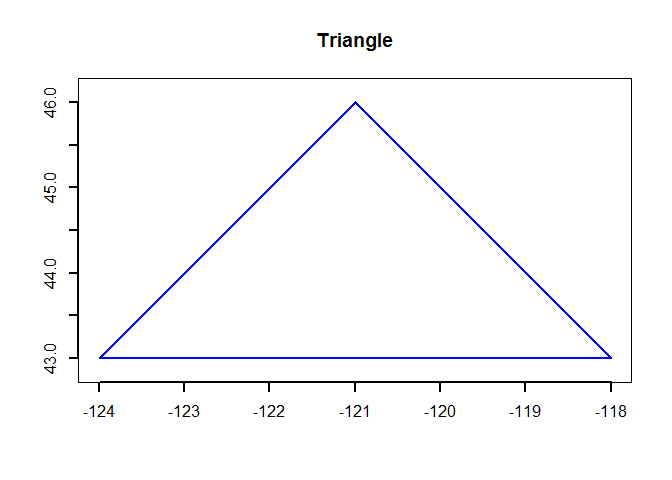
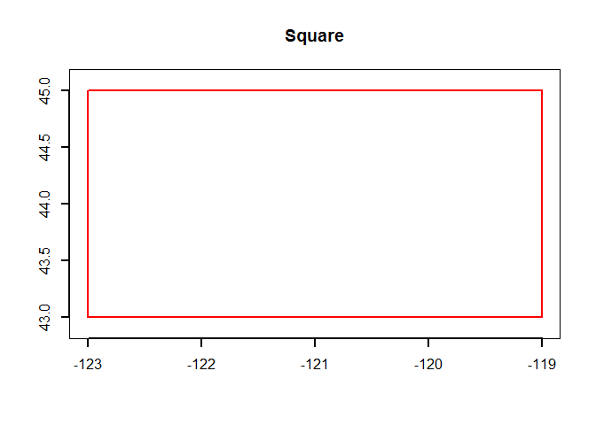
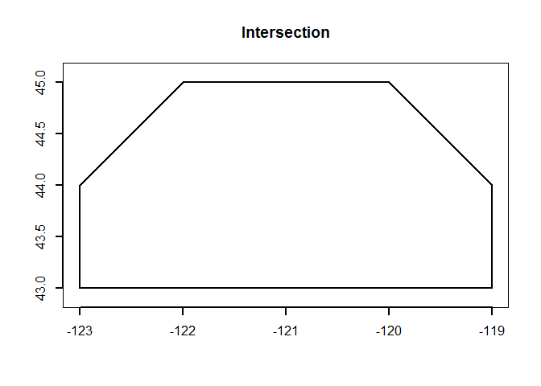
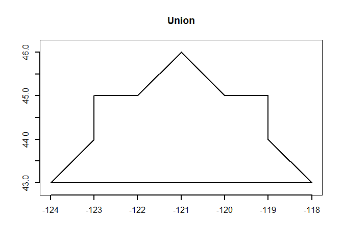

CAC measures degree of overlap of two areal units (see Taylor, P.J.
1977. Quantitative methods in geography, an introduction to spatial
analysis: Prospect Heights, IL, Waveland Press, chap. 5, 375 p.). Divide
the intersection of two areal units by the union of same two areal
units.

    library(sp)
    # Make a triangle
    triangle <- cbind(c(-124, -118,-121, -124),
                    c(43, 43, 46, 43))
    P1 = Polygon(triangle)
    Ps1 = Polygons(list(P1), ID="a")
    SP1 = SpatialPolygons(list(Ps1))
    plot(SP1, border="blue", lwd=2, axes=T, main='Triangle')

    # Make a square
    square <- cbind(c(-123, -119,-119, -123, -123),
                    c(43, 43, 45, 45, 43))
    P2 = Polygon(square)
    Ps2 = Polygons(list(P2), ID="a")
    SP2 = SpatialPolygons(list(Ps2))
    plot(SP2, border="red", lwd=2, axes=T, main='Square')

    # Now generate intersection and union of objects
    library(rgeos)
    # The intersection
    SP3 <- gIntersection(SP1, SP2, byid=T)
    plot(SP3, border="black", lwd=2, axes=T, main='Intersection')

    # The union
    SP4 <- gUnion(SP1, SP2, byid=T)
    plot(SP4, border="black", lwd=2, axes=T, main='Union')

    # Get the areas of the intersection and the union
    IntersectionArea = (sapply(slot(SP3, "polygons"), slot, "area"))
    UnionArea = (sapply(slot(SP4, "polygons"), slot, "area"))

    # Function to calculate CAC based on intersection and union
    CAC <- function(Intersection, Union) {  
      (Intersection / Union) * 100
    }

    # Return the Coefficient of Areal Correspondence for the two areas
    CAC(IntersectionArea, UnionArea)

    ## [1] 70

    # Done!
